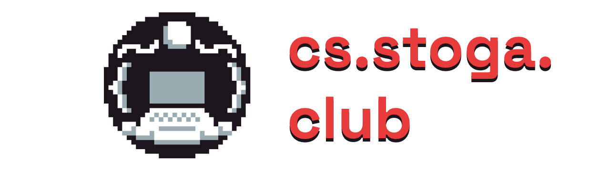

## About

> This is the website for the Conestoga Computer Science Club. It's usually maintained by a member of the club's current leadership (right now that's me) and *anybody* is welcome to contribute! Check it out at [stogacs.club](https://stogacs.club)

— Vishnu

## Instructions

First off, you'll probably want to install [NodeJS](https://nodejs.org/en/) and [npm](https://www.npmjs.com/), then install the repository by either [downloading it](https://github.com/stogacs/stogacs.club/archive/refs/heads/main.zip) or running `git clone https://github.com/stogacs/stogacs.club`

To start a dev server:

```
npm install
npm run start:dev
```

To build for production:
```
npm run build:prod
```

## Contributing
All pull requests are welcome.

## License
[MIT](https://choosealicense.com/licenses/mit/)
