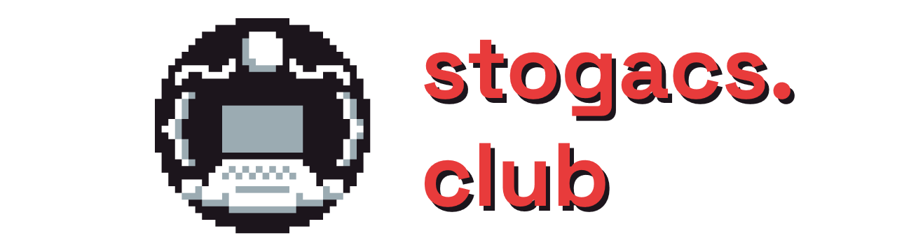

> **Note**  
> This is the repository for the Conestoga Computer Science Club's website. It's usually maintained by a member of the current club leadership, and everyone is welcome to contribute! Check it out at [stogacs.club](https://stogacs.club)

## Instructions

You'll want to first clone this repository. You can do this with the command `git clone https://github.com/stogacs/website`. If using VSCode, to view the website, you could use the [Live Server](https://marketplace.visualstudio.com/items?itemName=ritwickdey.LiveServer) extension.

## Contributing
All pull requests are welcome.

## License
[MIT](https://choosealicense.com/licenses/mit/)
